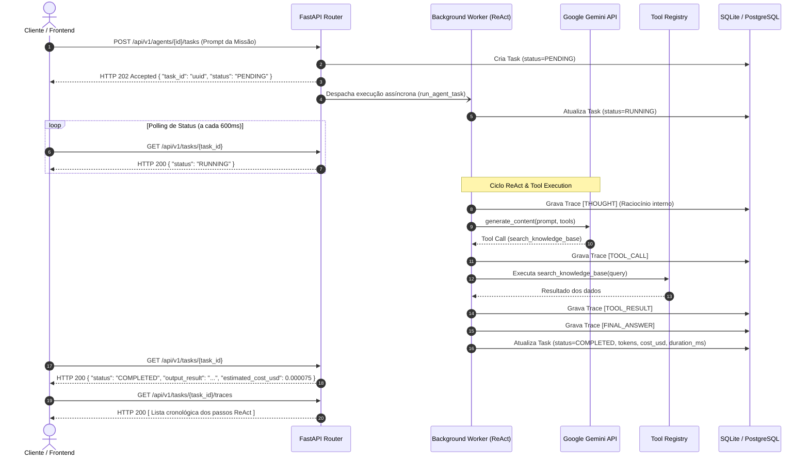

# ⚡ AgentPulse — AI Agent Orchestration & Observability Platform

<p align="center">
  
  
  
  
  
</p>

Plataforma de alta performance para **Orquestração e Observabilidade de Agentes Autônomos de IA (LLMOps)** com telemetria financeira, rastreamento passo a passo (*Traces*) e métricas analíticas consolidadas (*Data Analytics*).

---

## 📌 Padrões Arquiteturais Implementados

1. **Asynchronous Request-Reply Pattern:** A API aceita a solicitação do agente retornando imediatamente o código HTTP `202 Accepted` com `task_id` para acompanhamento via polling, evitando problemas de timeout em tarefas longas.
2. **ReAct Pattern (Reasoning + Acting):** O agente opera em um loop contínuo de raciocínio, acionando ferramentas externas conforme a necessidade antes de formular a resposta final.
3. **Distributed Tracing (Estilo OpenTelemetry / Langfuse):** Cada passo do agente (pensamentos, chamadas de ferramentas, parâmetros e retornos) é registrado individualmente no banco de dados para auditoria e depuração.
4. **Usage Metering Pattern:** Telemetria de consumo em tempo real (`prompt_tokens`, `completion_tokens`) e cálculo automatizado do custo em dólares (USD) baseado no modelo utilizado.
5. **Layered Architecture:** Separação estrita entre Presentation Layer (FastAPI Routers), Service/Orchestration Layer e Persistence Layer (SQLModel/Database).

---

## 🎬 Fluxo de Execução & Demonstração Visual

<!-- Coloque sua gravação em agentpulse-api/docs/agentpulse-demo.gif -->
<p align="center">
  
</p>

### 🔄 Diagrama de Sequência (Asynchronous Request-Reply + ReAct)



---

## 🏗️ Estrutura do Projeto

```
agentpulse-api/
├── app/
│   ├── api/
│   │   └── v1/
│   │       ├── endpoints/
│   │       │   ├── health.py        # Verificação de status da API
│   │       │   ├── agents.py        # CRUD e gerenciamento de agentes
│   │       │   ├── tasks.py         # Disparo assíncrono de missões e consulta de traces
│   │       │   └── analytics.py     # Endpoints de KPIs e métricas consolidadas
│   │       └── router.py            # Agregador central de rotas v1
│   ├── core/
│   │   ├── config.py                # Configurações de ambiente com Pydantic Settings
│   │   └── database.py              # Engine SQLModel e injeção de dependência de sessão
│   ├── models/                      # Modelos de banco de dados (Agent, Task, ExecutionTrace)
│   ├── schemas/                     # Contratos Pydantic de entrada e saída (DTOs)
│   ├── services/
│   │   ├── runner.py                # Motor de execução do agente (ReAct + Gemini API)
│   │   ├── cost_tracker.py          # Tabela de preços e cálculo de custo por token
│   │   ├── tools.py                 # Registro de ferramentas (Function Calling)
│   │   └── analytics_service.py     # Agregações analíticas via SQL
│   └── main.py                      # Ponto de entrada FastAPI com documentação Swagger
├── tests/                           # Suíte de testes automatizados com Pytest
├── .env.example
├── requirements.txt
└── README.md
```

---

## 🚀 Como Executar o Projeto Localmente

### 1. Clonar e Acessar o Diretório
```bash
cd agentpulse-api
```

### 2. Ativar o Ambiente Virtual
* **Windows (PowerShell):**
  ```powershell
  .\.venv\Scripts\Activate.ps1
  ```
* **Linux / Mac:**
  ```bash
  source .venv/bin/activate
  ```

### 3. Configurar as Variáveis de Ambiente
Copie o arquivo de exemplo:
```bash
cp .env.example .env
```
*(Opcional: insira sua `GEMINI_API_KEY`. Se deixada em branco, o sistema executa automaticamente em modo de simulação/demo).*

### 4. Iniciar o Servidor
```bash
uvicorn app.main:app --reload --port 8000
```

Acesse a documentação interativa e teste todos os endpoints diretamente no navegador:
👉 **[http://localhost:8000/docs](http://localhost:8000/docs)** (Swagger UI)  
👉 **[http://localhost:8000/redoc](http://localhost:8000/redoc)** (ReDoc)

---

## 🧪 Executando os Testes Automatizados

A suíte de testes valida o health check, a criação de agentes, o fluxo assíncrono de execução, os traces gerados e o dashboard de métricas:

```bash
pytest -v
```

---

## 📊 Endpoints Principais

| Método | Endpoint | Descrição |
| :--- | :--- | :--- |
| `GET` | `/api/v1/health` | Status de integridade da API |
| `POST` | `/api/v1/agents/` | Cadastra um novo agente com modelo e prompt do sistema |
| `GET` | `/api/v1/agents/` | Lista todos os agentes cadastrados |
| `POST` | `/api/v1/agents/{id}/tasks` | Dispara execução de tarefa (Retorna `202 Accepted`) |
| `GET` | `/api/v1/tasks/{id}` | Consulta status, resposta, tokens e custo financeiro |
| `GET` | `/api/v1/tasks/{id}/traces` | Retorna o passo a passo auditável do agente (ReAct) |
| `GET` | `/api/v1/analytics/overview` | Dashboard de KPIs (taxa de sucesso, gastos e latência) |
